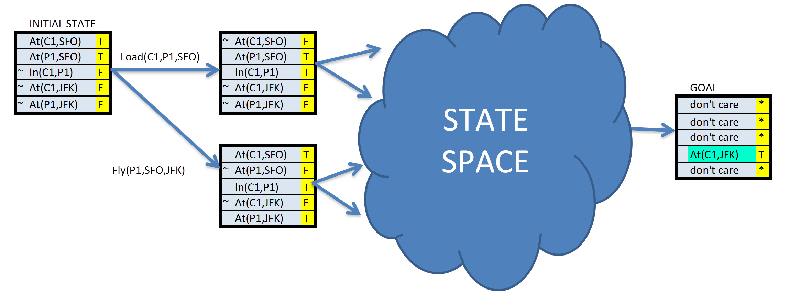

# Implement a Planning Search



## Synopsis

In this project I learned how to solve deterministic logistics planning problems for an Air Cargo transport system using a planning search agent. I used progression search algorithms to compute the optimal plan for each problem while implementing domain-independent heuristics.  This was my first introduction to PDDL (PLANNING DOMAIN DEFINITION LANGUAGE).

## code

This project requires python 3.  I personally use Anaconda, so I have provided a **aind-universal.yml** file at the root of the project to create an environment with all of the required dependencies.

```bash
bash$ conda env create -f aind-universal.yml
```
OSX & Linux
```bash
bash$ source activate aind
```
Windows
```bash
bash$ run activate aind
```
To run the cargo problems unit tests
```bash
(aind) bash$ python -m unittest tests.test_my_air_cargo_problems -v
```
To run the planning graph unit tests
```bash
(aind) bash$ python -m unittest tests.test_my_planning_graph -v
```


All problems are in the Air Cargo domain.  They have the same action schema defined, but different initial states and goals.

- Air Cargo Action Schema:
```
Action(Load(c, p, a),
    PRECOND: At(c, a) ∧ At(p, a) ∧ Cargo(c) ∧ Plane(p) ∧ Airport(a)
    EFFECT: ¬ At(c, a) ∧ In(c, p))
Action(Unload(c, p, a),
    PRECOND: In(c, p) ∧ At(p, a) ∧ Cargo(c) ∧ Plane(p) ∧ Airport(a)
    EFFECT: At(c, a) ∧ ¬ In(c, p))
Action(Fly(p, from, to),
    PRECOND: At(p, from) ∧ Plane(p) ∧ Airport(from) ∧ Airport(to)
    EFFECT: ¬ At(p, from) ∧ At(p, to))
```

- Problem 1 initial state and goal:
```
Init(At(C1, SFO) ∧ At(C2, JFK) 
    ∧ At(P1, SFO) ∧ At(P2, JFK) 
    ∧ Cargo(C1) ∧ Cargo(C2) 
    ∧ Plane(P1) ∧ Plane(P2)
    ∧ Airport(JFK) ∧ Airport(SFO))
Goal(At(C1, JFK) ∧ At(C2, SFO))
```
- Problem 2 initial state and goal:
```
Init(At(C1, SFO) ∧ At(C2, JFK) ∧ At(C3, ATL) 
    ∧ At(P1, SFO) ∧ At(P2, JFK) ∧ At(P3, ATL) 
    ∧ Cargo(C1) ∧ Cargo(C2) ∧ Cargo(C3)
    ∧ Plane(P1) ∧ Plane(P2) ∧ Plane(P3)
    ∧ Airport(JFK) ∧ Airport(SFO) ∧ Airport(ATL))
Goal(At(C1, JFK) ∧ At(C2, SFO) ∧ At(C3, SFO))
```
- Problem 3 initial state and goal:
```
Init(At(C1, SFO) ∧ At(C2, JFK) ∧ At(C3, ATL) ∧ At(C4, ORD) 
    ∧ At(P1, SFO) ∧ At(P2, JFK) 
    ∧ Cargo(C1) ∧ Cargo(C2) ∧ Cargo(C3) ∧ Cargo(C4)
    ∧ Plane(P1) ∧ Plane(P2)
    ∧ Airport(JFK) ∧ Airport(SFO) ∧ Airport(ATL) ∧ Airport(ORD))
Goal(At(C1, JFK) ∧ At(C3, JFK) ∧ At(C2, SFO) ∧ At(C4, SFO))
```

## Analysis

Below are the metrics for running  uninformed planning searches and A * planning searches with heuristics on  air_cargo_p1 ,  air_cargo_p2 , and air_cargo_p3  problems. I ran  breadth_first_search ,  depth_first_graph_search  and uniform_cost_search  for the uninformed searches and used A * with both the h_ignore_preconditions  and  h_pg_levelsum  heuristics for the heuristic searches. The tables below Compare and contrast the expansions, goal tests, new nodes, plan length, run time and optimality of each search strategy.

## Uninformed planning searches

**Air Cargo Problem 1**
| Search | Expansions | Goal Tests | New Nodes | Plan length | Time (s) | Optimality |
|--------|------------|------------|-----------|-------------|----------|------------|
| BFS    | 43         | 56         | 180       | 6           | 0.033    | Yes        |
| BFS    | 12         | 13         | 48        | 12          | 0.010    | No         |
| UCS    | 55         | 57         | 224       | 6           | 0.036    | Yes        |

**Air Cargo Problem 2**
| Search | Expansions | Goal Tests | New Nodes | Plan length | Time (s) | Optimality |
|--------|------------|------------|-----------|-------------|----------|------------|
| BFS    | 3343       | 4609       | 30509     | 9           | 7.859    | Yes        |
| BFS    | 582        | 583        | 5211      | 575         | 2.878    | No         |
| UCS    | 4852       | 4854       | 44030     | 9           | 11.488   | Yes        |

**Air Cargo Problem 3**
| Search | Expansions | Goal Tests | New Nodes | Plan length | Time (s) | Optimality |
|--------|------------|------------|-----------|-------------|----------|------------|
| BFS    | 14663      | 18098      | 129631    | 12          | 40.556   | Yes        |
| BFS    | 627        | 628        | 5176      | 596         | 3.146    | No         |
| UCS    | 18234      | 18236      | 159707    | 12          | 50.581   | Yes        |

## Conclusion
If finding an optimal path length is important, which I image it would be in most planning problems, then I would recommended BFS for an uninformed search strategy. Unlike DFS, its an optimal solution and it will always return the most optimal result, if one exists. While DFS generally traversed substantially fewer nodes, it seemed to be way off in regards to discovering an optimal solution. BFS also ran faster and used less memory than UCS.

## A* planning searches using the heuristics

The tables below illustrate running A * searches with both the h_ignore_preconditions and h_pg_levelsum heuristicsforproblems air_cargo_p1, air_cargo_p2, and air_cargo_p3.

**Air Cargo Problem 1**
| Search     | Expansions | Goal Tests | New Nodes | Plan length | Time (s) | Optimality |
|------------|------------|------------|-----------|-------------|----------|------------|
| HIP        | 41         | 43         | 170       | 6           | 0.035    | Yes        |
| h_levelsum | 39         | 41         | 158       | 6           | 0.791    | Yes        |

**Air Cargo Problem 2**
| Search     | Expansions | Goal Tests | New Nodes | Plan length | Time (s) | Optimality |
|------------|------------|------------|-----------|-------------|----------|------------|
| HIP        | 1450       | 1452       | 13303     | 9           | 3.574    | Yes        |
| h_levelsum | 1129       | 1131       | 10232     | 9           | 282.455  | Yes        |

**Air Cargo Problem 3**
| Search     | Expansions | Goal Tests | New Nodes | Plan length | Time (s) | Optimality |
|------------|------------|------------|-----------|-------------|----------|------------|
| HIP        | 5040       | 5042       | 44944     | 12          | 14.862   | Yes        |
| h_levelsum | ---        | ---        | ---       | ---         | ---      | ---        

*~ H_pg_levelsum did not finishing within the 10 minute limit.*
*The H_ignore_preconditions heuristic ran substantially quicker than the h_pg_levelsum heuristic for problem 2 (~90 times).*

## Conclusion and Recommendation
My search recommendation is to use A * search with the  h_ignore_preconditions  heuristic for all problems. The best performing uninformed search strategy was BFS and A * search with the h_ignore_preconditions  heuristic ran faster and traversed fewer nodes on every problem, with the exception of problem 1, where BFS was only 0.002 seconds faster.

the   ignore preconditions heuristic  works by dropping all preconditions from actions which ends up adding edges to the graph. This relaxes the problem and essentially makes it easier to solve. Every action becomes applicable in every state, and any single goal fluent can be achieved in one step. For many problems an accurate heuristic is obtained by considering (1) and ignoring (2). First, we relax the actions by removing all preconditions and all effects except those that are literals in the goal. Then, we count the minimum number of actions required such that the union of those actions’ effects satisfies the goal  (Norvig and Russell, 2009) .

After examining the results displayed in the tables above, it it evident that there are significant advantages to using informed search strategies with heuristics as opposed to using an uninformed search strategy. These advantages range from speed gains to decreases in required memory. I imagine the custom heuristics strategy becomes even more advantageous as problems grow in size and complexity. For example, if you were dealing with a very large graph you could optimize a heuristic for memory management, whereas an uninformed BFS will run the same on both small and large graphs.

### References
Artificial Intelligence: A Modern Approach (2009), Peter Norvig, Stuart J. Russell

